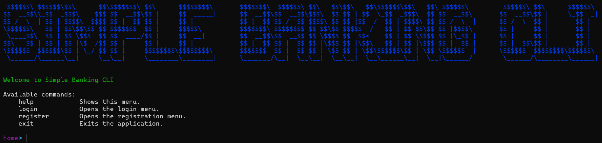

# Java Banking Application

A simple banking application developed with **Java Spring Boot** for the server-side and a **CLI-based client** using Spring WebClient. This project includes features like bank account creation, balance checking, and money transfers between accounts.



## Features

- **User Registration and Login**: Customers can register and log in using a CLI interface.
- **Bank Account Management**: Create and retrieve bank account information for a customer.
- **Money Transfer**: Transfer money between bank accounts with proper validation and error handling.
- **Edit Personal Information**: Customers can edit their personal information.
- **REST API**: Server-side developed with Spring Boot, handling client requests.
- **Database Connection**: Manually managing SQL connections using custom DAO classes.

## Technologies

- **Java 17**
- **Spring Boot**
- **Spring WebClient**
- **MySQL**
- **Maven**
- **SLF4J for logging**

## Getting Started
To run this project locally, you'll need to set up both the server and the client. Follow the steps below for each part.

### Server Setup

1. Clone the repository:
    ```bash
    git clone https://github.com/leloxo/simple-banking-cli.git
    cd simple-banking-cli/bank-server
    ```

2. Setup MySQL Database:
    - Create a MySQL database with `/src/main/resources/sql/create_database.sql`
    - Update the `/src/main/resources/config.properties` file with your MySQL connection details:
      ```bash
      db.url=jdbc:mysql://localhost:3306/bank_db
      db.user=root
      db.password=yourpassword
      ```
   - Update the `/src/main/resources/application.properties` file with your MySQL connection details:
      ```bash
      spring.datasource.url=jdbc:mysql://localhost:3306/bank_db
      spring.datasource.username=root
      spring.datasource.password=yourpassword
      ```

3. Build and Run the Server
   ```bash
   ./mvnw clean package
    java -jar target/bank-server-0.0.1-SNAPSHOT.jar
   ```

### Client Setup

1. Build and Run the Client
   ```bash
   cd bank-client
   ./mvnw clean package
    java -jar target/bank-client-0.0.1-SNAPSHOT.jar
   ```

## Usage
Once the server is running, you can use the CLI client to interact with the banking system.

